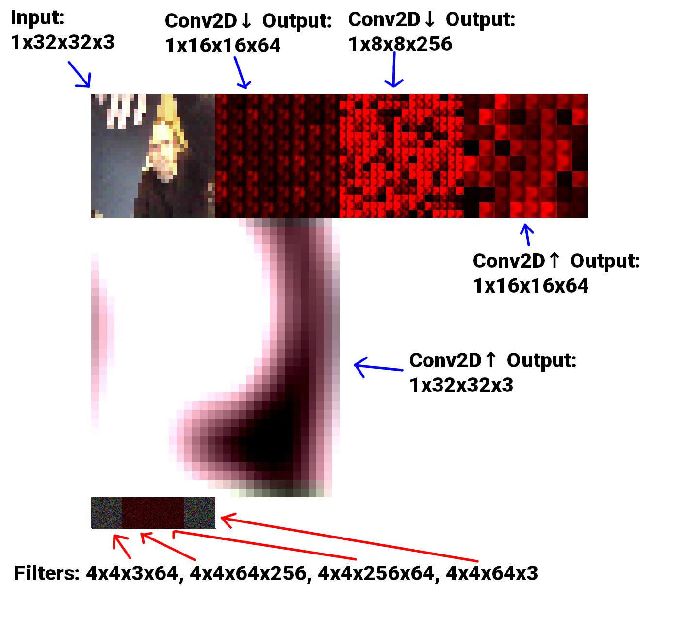
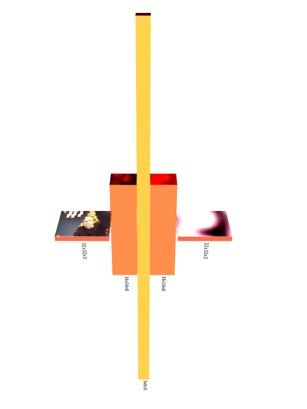

## WebGL (GLSL) Based Convolutional Neural Network

A 'pure' WebGL CNN built to compare the runtime of the requisite number of convolutions of a large generative model (like that of [Pix2Pix][p2p]) when the data is managed wholly by WebGL, against the likes of [TensorflowJS][tfjs] which involves more data managment on the Javascript side.

__TL;DR:__ It didn't break much ground, but was still an interesting experiment.



The model is an [_all convolutional net_][acnn] which pretty much consists entirely of 2D convolutions. There is some GLSL trickery to treat 2D textures like 3D tensor volumes which is [written about in more detail here][writeup]. The image above shows roughly how the model deals with the data; the filter kernels are randomly initialised in this demo hence the random values. The model above is that of a basic autoencoder shown in the diagram below.



## How Its Made

There is only really one `conv2d_class` which does all the work. It's simply a framebuffer which holds an output, filters and bias texures and takes an input as Float32 data, a texture or an HTML video element. The details of the model are defined at design-time as follows:

```javascript
const DOWNSCALE = new Conv2D(gl, {...});

const DOWNSCALE_2 = new Conv2D(
  gl,
  {
    input: {
      size: DOWNSCALE.opts.output.size,
      num_channels: 1,
      texture: DOWNSCALE.output,
    },
    output: {
      size: 8,
      num_channels: 1,
    },
    filter: {
      num_channels: 1,
      num: 16,
      type: 'down',
    },
    prev: {
      num_filters: DOWNSCALE.opts.filter.num,
    },
  },
  {
    vs: BASIC_VERT,
    fs: require('./glsl/downscale_2_frag.glsl'),
  }
);

const UPSCALE = new Conv2D(
  gl,
  {
    input: {
      size: DOWNSCALE_2.opts.output.size,
      num_channels: 1,
      texture: DOWNSCALE_2.output,
    },
    output: {
      size: 16,
      num_channels: 1,
    },
    filter: {
      num_channels: 1,
      num: 8,
      type: 'up',
    },
    prev: {
      num_filters: DOWNSCALE_2.opts.filter.num,
    },
  },
  {
    vs: BASIC_VERT,
    fs: require('./glsl/upscale_frag.glsl'),
  }
);

const UPSCALE_2 = new Conv2D(gl, {...});
```

The modular structure allows to connect a layer to the previous, and the extract any data at any time (at runtime). _This_ is the promising part of this work. It would be amazing to develop this to the point where the model could train specific to this particular architecure and then potentially influence the data _directly_ in the _training process_ or in _inference_. That's the dream any way.

For now, it was shown that a full size [Pix2Pix][p2p] style generator ran at the same amount of time as the equivalent model when run with TensorflowJS in the browser: __1.4s__. It's definitely worth saying though that the result for TensorflowJS was _with_ my custom made WebGL wrapper to handle image I/O to the model. More info on _that_ [here](https://joshmurr.github.io/cci-thesis-log/tensorflow/webgl/2020/11/22/learning-to-learn-to-see.html), and I'll link to the paper I wrote about that at some point.

[__A demo of a Pix2Pix model running in the browser for real-time video interaction can be seen here__][ltlts].

### [More information about this WebGL CNN stuff can be seen here](https://joshmurr.github.io/cci-thesis-log/webgl/cnn/2020/11/21/webgl-cnn-followup.html)

[p2p]: https://phillipi.github.io/pix2pix/
[tfjs]: https://github.com/tensorflow/tfjs
[acnn]: https://arxiv.org/abs/1412.6806
[writeup]: https://joshmurr.github.io/cci-thesis-log/webgl/cnn/glsl/2020/10/28/webgl-cnn.html
[ltlts]: https://learning-to-learn-to-see.netlify.app/
